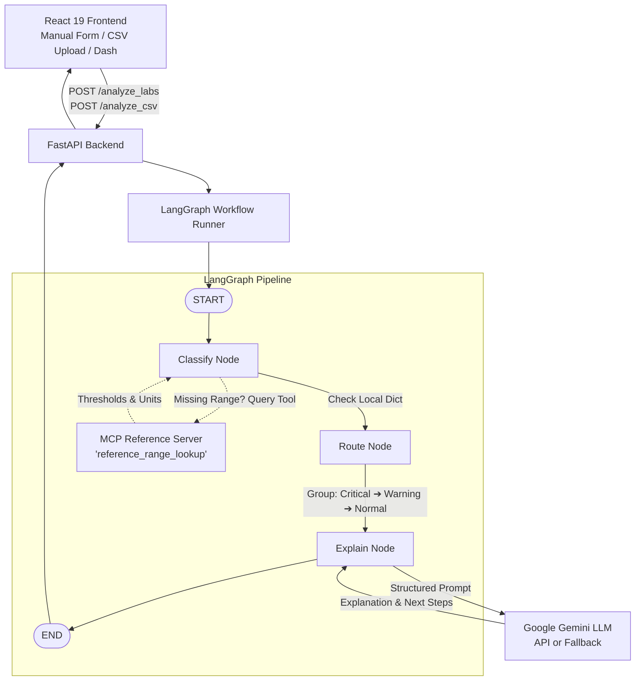

# Clinical Lab Results Analyzer

> **AI-Powered Explainable Clinical Laboratory Interpretation System**  
> Built with **FastAPI**, **LangGraph**, **Model Context Protocol (MCP)**, **Google Gemini**, and **React + Vite + Tailwind CSS**.

[](https://opensource.org/licenses/MIT)
[](https://www.python.org/downloads/)
[](https://fastapi.tiangolo.com)
[](https://github.com/langchain-ai/langgraph)
[](https://reactjs.org/)

---

## 1. Project Overview

The **Clinical Lab Results Analyzer** is an end-to-end medical test evaluation platform. It deterministically classifies laboratory test values using clinical reference ranges, orchestrates the multi-step evaluation using a clean **LangGraph** workflow, leverages an **MCP (Model Context Protocol)** server for dynamic tool-based reference range lookups, and synthesizes cautious, patient-friendly explanations and clinical recommendations via **Google Gemini**.

### Core Guarantees:
- **Deterministic Python Classification**: Normal / Warning / Critical severity is calculated strictly in Python code using established physiological thresholds, never delegated to generative hallucinations.
- **Explainable AI**: The LLM explains *why* a result was flagged, its potential clinical associations, and cautious next steps without modifying the authoritative classification.
- **Tolerant Batch Processing**: Supports single-test entry and CSV batch uploads with row-by-row failure tolerance.
- **Medical Safety First**: Clear educational disclaimers, probabilistic language ("may indicate", "can be associated with"), and strong recommendations for qualified clinician review.

---

## 2. Architecture



---

## 3. Technology Stack

### Backend
- **Language**: Python 3.11+ / Python 3.14 compatible
- **Framework**: FastAPI + Uvicorn
- **Validation**: Pydantic v2
- **Agent Workflow**: LangGraph (`StateGraph`, `START`, `END`)
- **Tool Protocol**: Model Context Protocol (`mcp` Python SDK / FastMCP)
- **Generative AI**: Google GenAI SDK (`google-genai`)
- **Data Handling**: Pandas (CSV parsing and row validation)
- **Testing**: Pytest (100% mocked offline test suite)

### Frontend
- **Framework**: React 19 + Vite
- **Styling**: Tailwind CSS v4 + Custom Clinical Design System
- **Icons**: Lucide React
- **HTTP Client**: Axios

---

## 4. MCP (Model Context Protocol) Architecture

This application includes a standard MCP server in [`backend/app/mcp/server.py`](file:///d:/python/analyzer/backend/app/mcp/server.py).

### How MCP is Used:
1. When a test result arrives at the LangGraph `classify` node, the system first checks the core local reference range registry.
2. If the test is an extended or non-standard test (e.g. `cholesterol`, `hba1c`, `tsh`, `troponin`, `ferritin`), the classifier invokes the MCP client adapter:
   ```python
   ref = mcp_client.query_reference_range(test_name)
   ```
3. The MCP server tool `reference_range_lookup` is called with:
   ```json
   {
     "test_name": "cholesterol"
   }
   ```
4. The tool returns structured threshold metadata:
   ```json
   {
     "test_name": "Total Cholesterol",
     "unit": "mg/dL",
     "normal_min": 125.0,
     "normal_max": 200.0,
     "warning_min": 100.0,
     "warning_max": 240.0,
     "critical_min": 70.0,
     "critical_max": 350.0,
     "source": "mcp_server"
   }
   ```
5. The result card displays an **MCP Tool Lookup** badge indicating dynamic tool retrieval.

---

## 5. LangGraph Workflow

The LangGraph pipeline in [`backend/app/graph/graph.py`](file:///d:/python/analyzer/backend/app/graph/graph.py) follows a linear pattern:

```text
START ──▶ classify ──▶ route ──▶ explain ──▶ END
```

### State Definition:
```python
class LabState(TypedDict):
    labs: list[dict]
    classified_results: list[dict]
    routed_results: dict[str, list[dict]]
    explanations: list[dict]
    final_results: list[dict]
    summary: dict[str, int]
    validation_errors: list[dict]
```

### Nodes:
1. **`classify`**: Deterministically matches each test value against the resolved physiological reference range. Computes status (`NORMAL`, `WARNING`, `CRITICAL`) and generates the deterministic "Why flagged?" statement.
2. **`route`**: Partitions results into three buckets: `critical`, `warning`, and `normal`. Sorts the final output with highest clinical risk first: **Critical ➔ Warning ➔ Normal**.
3. **`explain`**: Formulates a constrained prompt to Google Gemini for structured clinical explanations, potential associations, and recommended next steps. Never allows the LLM to change the classification.

---

## 6. Project Structure

```text
clinical-lab-analyzer/
├── backend/
│   ├── app/
│   │   ├── __init__.py
│   │   ├── main.py                    # FastAPI application & lifespan
│   │   ├── config.py                  # Settings & environment loading
│   │   ├── api/
│   │   │   ├── __init__.py
│   │   │   └── routes.py              # /health, /analyze_labs, /analyze_csv
│   │   ├── models/
│   │   │   ├── __init__.py
│   │   │   └── schemas.py             # Pydantic models & validation
│   │   ├── graph/
│   │   │   ├── __init__.py
│   │   │   ├── state.py               # LabState TypedDict
│   │   │   ├── nodes.py               # Classify, Route, Explain nodes
│   │   │   └── graph.py               # LangGraph StateGraph compiler
│   │   ├── services/
│   │   │   ├── __init__.py
│   │   │   ├── classifier.py          # Deterministic classification logic
│   │   │   ├── llm.py                 # Gemini integration & offline fallback
│   │   │   └── csv_parser.py          # Pandas CSV parser with partial error capture
│   │   ├── tools/
│   │   │   ├── __init__.py
│   │   │   └── reference_ranges.py    # Reference thresholds & aliases
│   │   └── mcp/
│   │       ├── __init__.py
│   │       ├── server.py              # MCP tool reference_range_lookup
│   │       └── client.py              # MCP client adapter
│   ├── tests/
│   │   ├── __init__.py
│   │   ├── test_classifier.py         # Unit tests for classification logic
│   │   ├── test_graph.py              # LangGraph workflow tests
│   │   └── test_api.py                # FastAPI integration tests
│   ├── requirements.txt
│   └── .env.example
├── frontend/
│   ├── src/
│   │   ├── components/
│   │   │   ├── Header.jsx             # Clinical navbar & backend status
│   │   │   ├── DisclaimerBanner.jsx   # Medical safety disclaimer
│   │   │   ├── SummaryCards.jsx       # Severity metric cards & filter triggers
│   │   │   ├── LabInputForm.jsx       # Manual input with sample panel buttons
│   │   │   ├── CsvUpload.jsx          # Drag-and-drop CSV upload & preview
│   │   │   ├── ResultCard.jsx         # Card with visual range meter & AI explanation
│   │   │   ├── ResultsSection.jsx     # Filterable results container & JSON export
│   │   │   └── SeverityBadge.jsx      # Color-coded severity badge
│   │   ├── services/
│   │   │   └── api.js                 # Axios backend API client
│   │   ├── App.jsx                    # Root view orchestrator
│   │   ├── index.css                  # Tailwind CSS styling tokens
│   │   └── main.jsx
│   ├── package.json
│   └── vite.config.js
├── test_data/
│   ├── normal.csv                     # 12 synthetic normal tests
│   ├── warning.csv                    # 12 synthetic borderline tests
│   └── critical.csv                   # 12 synthetic critical tests
├── Dockerfile.backend
├── Dockerfile.frontend
├── docker-compose.yml
├── .gitignore
└── README.md
```

---

## 7. Setup & Installation

### Prerequisites
- Python 3.11+
- Node.js 18+ and npm
- (Optional) Docker & Docker Compose

### Step 1: Clone and Configure Environment
```bash
git clone <repo-url>
cd clinical-lab-analyzer

# Configure backend environment
cp backend/.env.example backend/.env
```

Edit `backend/.env` to supply your Google Gemini API key:
```env
GOOGLE_API_KEY=AIzaSyYourKeyHere
GEMINI_MODEL=gemini-2.5-flash
PORT=8000
HOST=0.0.0.0
```
> *Note: If `GOOGLE_API_KEY` is omitted, the application automatically engages a built-in deterministic clinical explanation engine so that demos, unit tests, and development work seamlessly offline.*

### Step 2: Run Backend
```bash
# Windows
python -m venv venv
.\venv\Scripts\activate
pip install -r backend/requirements.txt
uvicorn backend.app.main:app --host 0.0.0.0 --port 8000 --reload

# macOS / Linux
python3 -m venv venv
source venv/bin/activate
pip install -r backend/requirements.txt
uvicorn backend.app.main:app --host 0.0.0.0 --port 8000 --reload
```
The FastAPI interactive documentation is now available at:
`http://localhost:8000/docs`

### Step 3: Run Frontend
In a separate terminal window:
```bash
cd frontend
npm install
npm run dev
```
Open your browser at:
`http://localhost:5173`

---

## 8. Docker Deployment

To launch both backend and frontend in Docker:
```bash
docker compose up --build
```
- Frontend UI: `http://localhost:5173`
- Backend API: `http://localhost:8000`

---

## 9. API Reference

### Health Check
```http
GET /health
```
**Response:**
```json
{
  "status": "ok",
  "service": "clinical-lab-analyzer",
  "version": "1.0.0"
}
```

### Analyze Laboratory Results
```http
POST /analyze_labs
Content-Type: application/json
```
**Request:**
```json
{
  "labs": [
    {
      "test_name": "Hemoglobin",
      "value": 9.2,
      "unit": "g/dL"
    },
    {
      "test_name": "Glucose",
      "value": 95.0,
      "unit": "mg/dL"
    },
    {
      "test_name": "Potassium",
      "value": 6.8,
      "unit": "mmol/L"
    }
  ]
}
```
**Response:**
```json
{
  "results": [
    {
      "test_name": "Serum Potassium",
      "value": 6.8,
      "unit": "mmol/L",
      "status": "CRITICAL",
      "reference_range": "3.5 - 5.0 mmol/L",
      "why_flagged": "Serum Potassium is 6.8 mmol/L, which is critically elevated and exceeds the critical safety threshold (> 6.2 mmol/L).",
      "explanation": "Your Serum Potassium level is 6.8 mmol/L, which is significantly outside the typical physiological reference range (3.5 - 5.0 mmol/L) and falls into the critical alert zone.",
      "possible_significance": "Marked deviations in Serum Potassium may be associated with acute metabolic, hematologic, or cardiac rhythm disturbances.",
      "suggested_next_steps": [
        "Seek prompt medical evaluation or contact your prescribing clinician immediately.",
        "Do not adjust medications or start supplements without direct physician guidance.",
        "A repeat confirmation test and comprehensive clinical examination are strongly recommended."
      ],
      "normal_min": 3.5,
      "normal_max": 5.0,
      "warning_min": 3.0,
      "warning_max": 5.5,
      "critical_min": 2.8,
      "critical_max": 6.2,
      "lookup_source": "local"
    }
  ],
  "summary": {
    "critical": 1,
    "warning": 1,
    "normal": 1,
    "total": 3
  },
  "validation_errors": [],
  "disclaimer": "This tool is for educational/informational purposes only and does not provide a medical diagnosis..."
}
```

### Upload CSV Dataset
```http
POST /analyze_csv
Content-Type: multipart/form-data
```
Accepts any standard CSV file with columns `test_name`, `value`, `unit`.

---

## 10. Synthetic Test Datasets

Three synthetic, anonymized test datasets are provided in the [`test_data/`](file:///d:/python/analyzer/test_data/) directory:

| File | Tests | Primary Classification | Purpose |
|------|-------|------------------------|---------|
| `test_data/normal.csv` | 12 | Normal | Demonstrates baseline healthy physiological ranges |
| `test_data/warning.csv` | 12 | Warning | Demonstrates mild out-of-range deviations (e.g. mild anemia, prediabetes glucose) |
| `test_data/critical.csv` | 12 | Critical | Demonstrates critical values requiring prompt clinical attention (e.g. potassium 6.8, platelets 32,000) |

---

## 11. Testing

Run the automated test suite with pytest:
```bash
.\venv\Scripts\pytest backend/tests -v
```

### Verified Test Cases:
- Normal, Warning, and Critical threshold checks
- Lower boundary and upper boundary conditions
- MCP tool fallback resolution for extended tests
- Input validation on missing or non-numeric values
- LangGraph pipeline execution and strict severity ordering (Critical ➔ Warning ➔ Normal)
- Partial failure tolerance in CSV batch processing
- `/health`, `/analyze_labs`, and `/analyze_csv` endpoints

---

## 12. Medical Disclaimer

> **IMPORTANT MEDICAL NOTICE**:  
> This application is created for educational, research, and informational purposes only and **does not constitute medical advice or a formal medical diagnosis**. Laboratory reference ranges vary across clinical laboratories, assay methods, sex, age, and individual patient circumstances. Always consult a qualified physician or healthcare provider for interpretation of laboratory results and clinical treatment planning.
